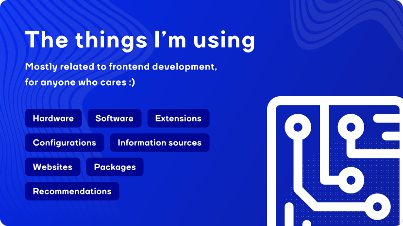

# @morev/use

The things I am using :)

## Table of contents

* [Hardware](#hardware)
  * [Environment](#environment)
  * [Workstation](#workstation)
  * [Video recording](#video-recording)
    * [Recording devices and accessories](#recording-devices-and-accessories)
    * [Illumination](#illumination)
    * [Sound recording](#sound-recording)
* [Software](#software)
* [Chrome extensions](#chrome-extensions)
* [Editor](#editor)
  * [Useful shortcuts](#useful-shortcuts)
  * [Extensions](#extensions)
* [Packages](#packages)
* [Websites](#websites)

## Hardware

### Environment

* Chair: AndaSeat T-Pro 2 *(slightly customized)*
* Table: custom 1900x1100x40mm tabletop with ergonomic 250mm cutout and height adjustment from 75сm to 115cm

### Workstation

* Monitor: 27" AOC Q27G2U/BK (x3)
* Monitor arm: Arctic Z3 Pro
* Sound: Thonet&Vander Dunn Soundbar
* Mouse: A4Tech X-710BK
* Keyboard: just a random one, really
* Data storage: WD Green SN350 (1Tb M.2 NVMe) + Samsung 980 PRO (256Gb M.2 NVMe)
* RAM: Kingston FURY Beast Black RGB - 16GB * 4 (64GB in total)
* Video card: GeForce RTX 3050 CORE
* CPU: Intel Core i5-12500

### Video recording

#### Recording devices and accessories

* Camera: Panasonic Lumix G7
* Camera lens: Sigma AF 16mm f/1.4 DC DN Contemporary Micro 4/3
* Camera stand: Table stand ZM-35Z
* Capture card: AverMedia Live Streamer CAP 4K
* Spare camera: Logitech 4K Ultra HD Webcam BRIO *(not that bad, but not worth the money)*

#### Illumination

* Primary light: LED-800 ISA
* Softbox: Ambitful P60C
* Filler light: Ulanzi VL119
* Backlight: Yongnuo YN300 AIR II
* Background light: JBH FL-36 (x2)

### Sound recording

* Microphone: Shure SM7B
* Microphone stand: Blue Compass
* Audio Interface: TC Helicon Go XLR Mini

## Software

* [Windows 11](https://www.microsoft.com/software-download/windows11) as OS;
* [VSCode](https://code.visualstudio.com/) as a primary editor;
* [Total Commander](https://www.ghisler.com/) as a file manager;
* [Figma](https://www.figma.com/) as a desktop app;
* [Obsidian](https://obsidian.md/) for notes, ideas and so on;
* [OBS](https://obsproject.com/) as a video/screen recorder;
* [Adobe Premiere](https://www.adobe.com/products/premiere.html) as a video editor.

## Chrome extensions

* [Adblock Plus](https://chromewebstore.google.com/detail/adblock-plus-%D0%B1%D0%B5%D1%81%D0%BF%D0%BB%D0%B0%D1%82%D0%BD%D1%8B%D0%B9-%D0%B1/cfhdojbkjhnklbpkdaibdccddilifddb)
* [daily.dev](https://chromewebstore.google.com/detail/dailydev-the-homepage-dev/jlmpjdjjbgclbocgajdjefcidcncaied?pli=1)
* [ColorZilla](https://chromewebstore.google.com/detail/colorzilla/bhlhnicpbhignbdhedgjhgdocnmhomnp)
* [File Icons for GitHub and GitLab](https://chromewebstore.google.com/detail/file-icons-for-github-and/ficfmibkjjnpogdcfhfokmihanoldbfe)
* [Gismeteo](https://chromewebstore.google.com/detail/gismeteo/bfegaehidkkcfaikpaijcdahnpikhobf)
* [JSON Viewer](https://chromewebstore.google.com/detail/json-viewer/gbmdgpbipfallnflgajpaliibnhdgobh)
* [PageSpeed Insights (MV3)](https://chromewebstore.google.com/detail/pagespeed-insights-mv3/lanlbpjbalfkflkhegagflkgcfklnbnh)
* [Validity](https://chromewebstore.google.com/detail/validity/bbicmjjbohdfglopkidebfccilipgeif)
* [Video Speed Controller](https://chromewebstore.google.com/detail/video-speed-controller/nffaoalbilbmmfgbnbgppjihopabppdk)
* [Viewport Dimensions](https://chromewebstore.google.com/detail/viewport-dimensions/kchdfagjljmhgapoonapmfngpadcjkhk)
* [Wappalyzer - Technology profile](https://chromewebstore.google.com/detail/wappalyzer-technology-pro/gppongmhjkpfnbhagpmjfkannfbllamg)
* [WhatFont](https://chromewebstore.google.com/detail/whatfont/jabopobgcpjmedljpbcaablpmlmfcogm)

## Editor

* Editor: [VSCode](https://code.visualstudio.com/)
* Theme: slightly customized [Material-last](https://marketplace.visualstudio.com/items?itemName=tjlastnumber.material-last)
* Font: Courier New

### Useful shortcuts

* `Ctrl + Shift + P` - open developer toolbar
* `Ctrl + E` - go to file
* `Ctrl + R` - open a project
* `Ctrl + Shift + F` - switch sidebar to project-wide search
* `Ctrl + Shift + E` - switch sidebar to file tree
* `Ctrl + Shift + /` - switch to closing/opening bracket
* `Ctrl + D` - duplicate string/line
* `Alt + ArrowUp/ArrowDown` - move the line of code
* `Ctrl + [Shift] + U` - lowercase/uppercase selection (non-standard)
* `Ctrl + F`, `Ctrl + H` - file-wide search / replace
* `Ctrl + K + [1-3]` - fold by indentation
* `Ctrl + Shift + A` - switch file via `Alternate file` extension

### Extensions

> Some obvious extensions like ESLint, Stylelint, framework extensions and so on are intentionally omitted here -
> only what might be niche is listed.

* [Alternate File](https://marketplace.visualstudio.com/items?itemName=will-wow.vscode-alternate-file) to quickly switch between related files;
* [Batch rename](https://marketplace.visualstudio.com/items?itemName=JannisX11.batch-rename-extension) to bulk rename a group of files;
* [Bookmarks](https://marketplace.visualstudio.com/items?itemName=alefragnani.Bookmarks) for bookmarking code;
* [Code Spell Checker](https://marketplace.visualstudio.com/items?itemName=streetsidesoftware.code-spell-checker) for spell check (please stop misspellig)
* [CodeSnap](https://marketplace.visualstudio.com/items?itemName=adpyke.codesnap) for code screenshots that I use in videos;
* [ErrorLens](https://marketplace.visualstudio.com/items?itemName=usernamehw.errorlens) to make the mistakes really noticeable;
* [filesize](https://marketplace.visualstudio.com/items?itemName=mkxml.vscode-filesize) can be useful when you're thinking about optimizing;
* [Import Cost](https://marketplace.visualstudio.com/items?itemName=wix.vscode-import-cost) to avoid accidentally importing in half a megabyte of code;
* [SVG Previewer](https://marketplace.visualstudio.com/items?itemName=vitaliymaz.vscode-svg-previewer) - displays SVG directly in the editor;
* [TODO Highlight](https://marketplace.visualstudio.com/items?itemName=wayou.vscode-todo-highlight) Allows me not to forget about TODO comments (ha ha);
* [WakaTime](https://marketplace.visualstudio.com/items?itemName=WakaTime.vscode-wakatime) collects information on working hours.

## Packages

I'd recommend to use:

* [Swiper.js](https://swiperjs.com/) for any sliders;
* [Air-datepicker](https://air-datepicker.com/) for date/datetime pickers;
* [Floating-UI](https://floating-ui.com/) to work with floating elements;
* [Lefthook](https://github.com/evilmartians/lefthook) as a Git hooks manager;
* [Maskito](https://maskito.dev/getting-started/what-is-maskito) to work with text field masks.

## Websites

* [Deepl.com](https://www.deepl.com/translator) as a primary translator;
* [Reverso](https://context.reverso.net/) as a context-based translator;
* [Regex101](https://regex101.com/) for realtime regex testing;
* [arethetypeswrong](https://arethetypeswrong.github.io/) for checking the types of your package.

---

Feel free to ask for something else: \
[Telegram](https://t.me/max_seainside) / [Email](mailto:max.seainside@gmail.com)
